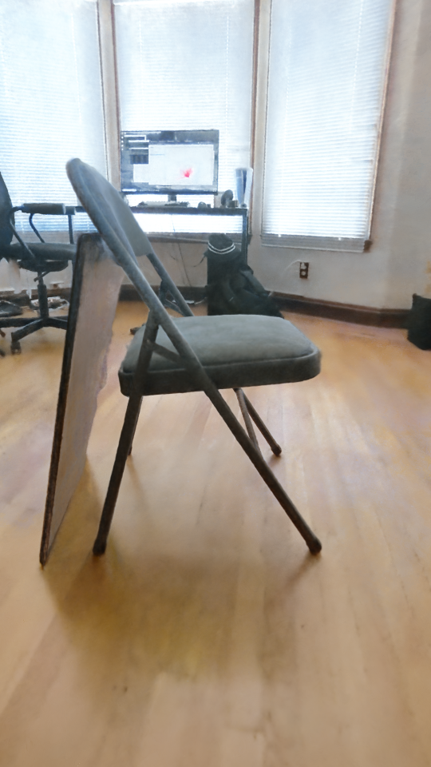
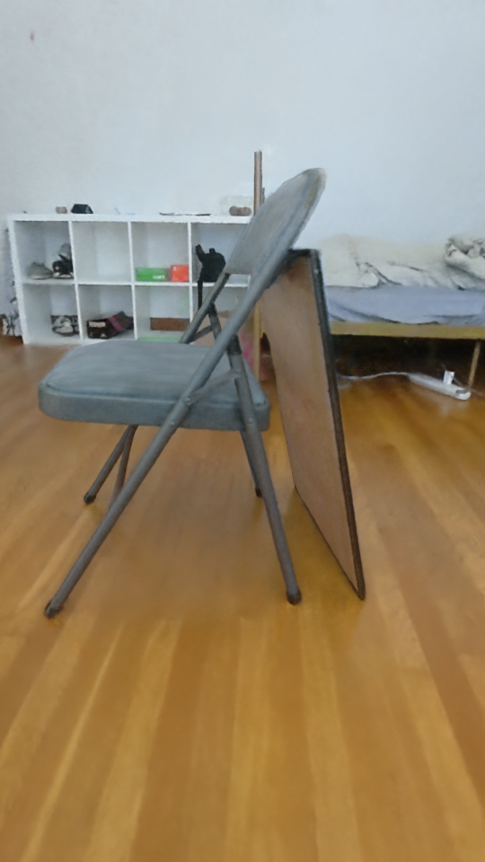
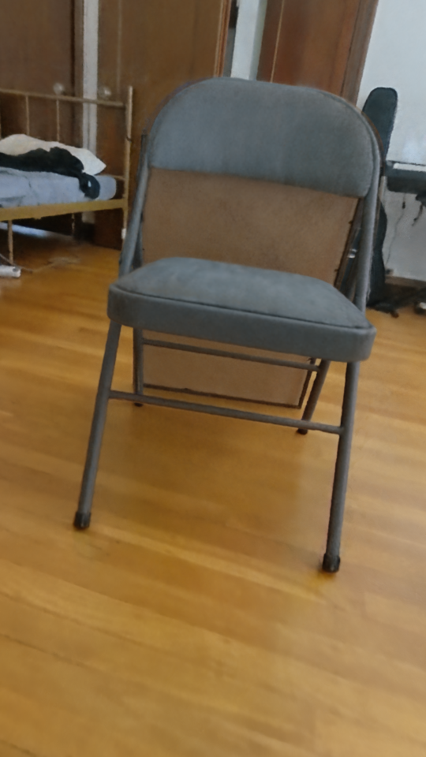
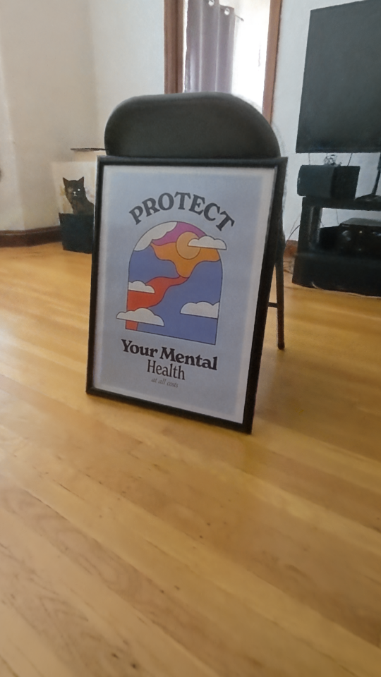
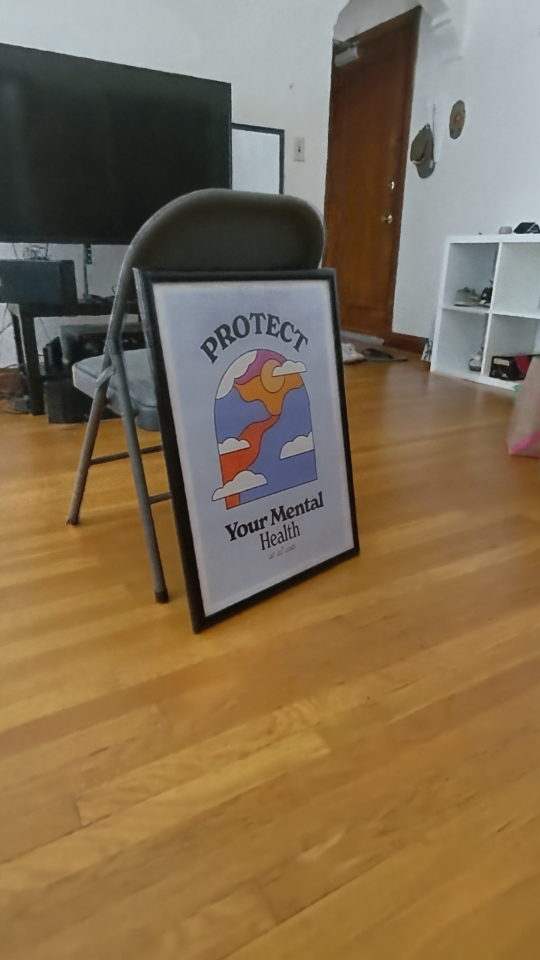
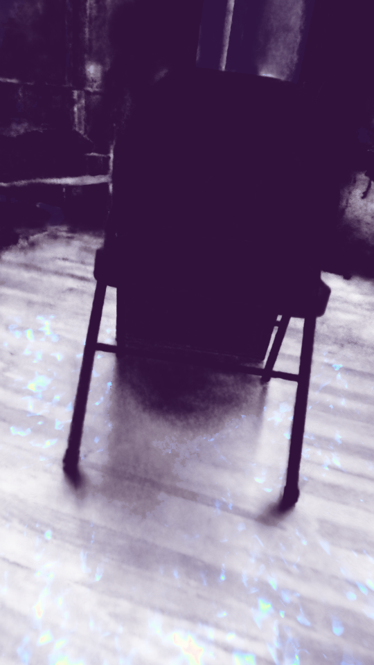
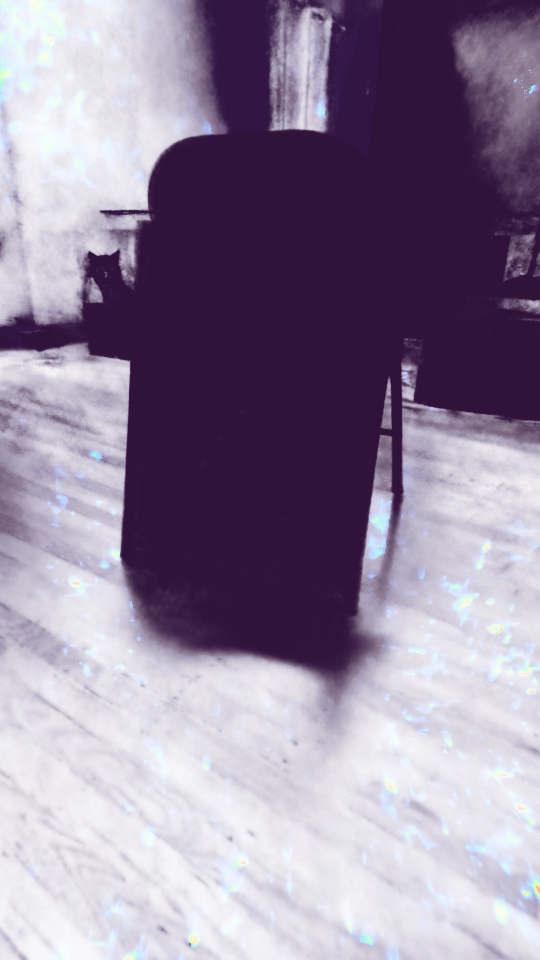

<div align="center">

# 🌌 NeRF Project Renders

English | [한국어](README.ko.md)



**Neural Radiance Fields — Render Artifact Archive**

<sub>A small gallery of <code>nerfacto</code> render screenshots — RGB &amp; depth frames.</sub>

<br/>

[](#-about)
[](#%EF%B8%8F-frame-index)
[](#%EF%B8%8F-frame-index)
[](#-references)
[](#-repository-structure)

</div>

---

## 📑 Table of Contents

- [📖 About](#-about)
- [🖼️ Gallery](#%EF%B8%8F-gallery)
- [🌗 RGB ↔ Depth Pairs](#-rgb--depth-pairs)
- [🗂️ Frame Index](#%EF%B8%8F-frame-index)
- [📁 Repository Structure](#-repository-structure)
- [🧭 Usage Notes](#-usage-notes)
- [🧪 References](#-references)
- [👤 Maintainer](#-maintainer)

---

## 📖 About

This repository is an **artifact archive** containing only rendered PNG outputs from a NeRF (Neural Radiance Fields) pipeline.
Training code, datasets, camera poses, and model checkpoints are **not** included.

| Item | Details |
|---|---|
| 🎯 **Purpose** | Static image hosting for presentations, Notion pages, and blog posts |
| 📦 **Contents** | RGB and depth frames rendered along a camera path after NeRF training |
| 🧰 **Pipeline** | `nerfacto` output *(per commit history)* |
| 🚫 **Not included** | Training code, source images/video, camera calibration, model weights |

> This repository alone cannot reproduce the training results. It is designed for quickly previewing visual outputs or embedding them in external documents.

---

## 🖼️ Gallery

5 RGB render frames. *(540 × 960, portrait orientation)*

<table>
  <tr>
    <td align="center"><br/><sub><b>frame_00001</b></sub></td>
    <td align="center"><br/><sub><b>frame_00044</b></sub></td>
    <td align="center"><br/><sub><b>frame_00088</b></sub></td>
  </tr>
  <tr>
    <td align="center"><br/><sub><b>frame_00132</b></sub></td>
    <td align="center"><br/><sub><b>frame_00177</b></sub></td>
    <td align="center"><sub>— end of sequence —</sub></td>
  </tr>
</table>

---

## 🌗 RGB ↔ Depth Pairs

Side-by-side comparison of color (RGB) and depth outputs for matching frame numbers.

<table>
  <tr>
    <th align="center">Frame</th>
    <th align="center">RGB</th>
    <th align="center">Depth</th>
  </tr>
  <tr>
    <td align="center"><b><code>00044</code></b></td>
    <td align="center"></td>
    <td align="center"></td>
  </tr>
  <tr>
    <td align="center"><b><code>00132</code></b></td>
    <td align="center"></td>
    <td align="center"></td>
  </tr>
</table>

---

## 🗂️ Frame Index

| Frame   | RGB | Depth | Note |
|:-------:|:---:|:-----:|:-----|
| `00001` | ✅  |  —   | Sequence start |
| `00044` | ✅  |  ✅  | RGB ↔ Depth pair |
| `00088` | ✅  |  —   | — |
| `00132` | ✅  |  ✅  | RGB ↔ Depth pair |
| `00177` | ✅  |  —   | Sequence end |

**Total**: 5 RGB + 2 Depth = 7 PNG files.

---

## 📁 Repository Structure

```text
nerf-project-renders/
├── rgb/                       # Color (RGB) render output
│   ├── frame_00001.png
│   ├── frame_00044.png
│   ├── frame_00088.png
│   ├── frame_00132.png
│   └── frame_00177.png
└── depth/                     # Depth render output
    ├── frame_00044.png
    └── frame_00132.png
```

---

## 🧭 Usage Notes

### Embedding in External Documents (Notion, Blogs, Slides)

Use the GitHub raw URL directly as an image source:

```markdown

```

```html

```

### Clone Locally

```bash
git clone https://github.com/mrpc2003/nerf-project-renders.git
cd nerf-project-renders
```

<details>
<summary>📌 Naming convention for adding new renders</summary>

- Filename format: `frame_<5-digit number>.png` (e.g., `frame_00088.png`)
- Place RGB renders in `rgb/`, depth renders in `depth/`
- When possible, maintain matching frame numbers for **RGB ↔ Depth pairs** to keep comparison tables clean.

</details>

---

## 🧪 References

- Render outputs in this repository are identified as `nerfacto` pipeline results *(per commit messages)*.
- [nerfstudio](https://github.com/nerfstudio-project/nerfstudio) — the NeRF training/rendering framework that includes `nerfacto`.

> ⚠️ Training code and scene data are not included in this repository. The framework reference alone is not sufficient to reproduce these exact results.

---

<div align="center">

## 👤 Maintainer

**Woohyun Kim** &middot; [`@mrpc2003`](https://github.com/mrpc2003)

<sub>📷 NeRF render artifacts — image archive only.</sub>

</div>
